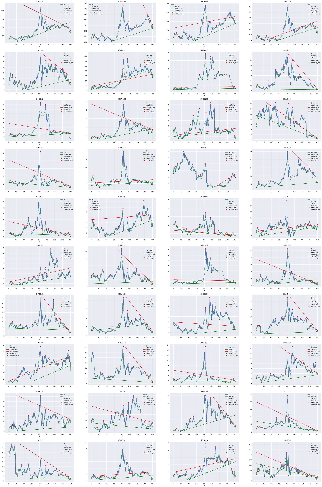

# 支撑线压力线绘制

支撑线（support line）又称为抵抗线。当股价跌到某个价位附近时，股价停止下跌，甚至有可能还有回升，这是因为多方在此买入造成的。支撑线起阻止股价继续下跌的作用。这个起着阻止股价继续下跌或暂时阻止股价继续下跌的位置就是支撑线所在的位置。

压力线（resistance line）又称为阻力线。当股价上涨到某价位附近时，股价会停止上涨，甚至回落，这是因为空方在此抛出造成的。压力线起阻止股价继续上升的作用。这个起着阻止或暂时阻止股价继续上升的位置就是压力线所在的位置。

因为支撑线压力线的定义不够精确，有较强的主观差异，所以不同的人在同一条时间序列数据上可能会作出完全不同的支撑线压力线。

这里我们采用精确的数学算法来绘制支撑线压力线。

这套算法主要有四个步骤：多项式拟合、寻找极值、聚类分析、图像绘制。

## 绘制逻辑

1.多项式拟合

这里以30分之一序列长度作为窗口的移动平均线作为参考线，从项数取40分之一时间序列长度开始迭代，整体误差在移动平均线的0.6倍以内时停止迭代。

2.遍历多项式曲线取极值

不管画支撑线还是压力线都同时计算极大值和极小值。极值的计算采用一阶导数取零点、二阶导数区分的方式。以支撑线为例，遍历极小值，以任意一个极小值两边的极大值之内的区间，对原序列取最小值，作为支撑点。

3.邻近聚类

对极值聚类，把相距非常近的极值剔除。

4.找线

从最后一个支撑点出发，和其之前的所有支撑点连线。对斜率用Kmeans聚类，每类取最下方一条线，该类点个数为count，该类所有点到该直线的平均距离为mean_distance，该类所有点的横坐标标准差为std，平均值为mean_x，评分公式为
(mean_distance / std / mean_x).rank() / count
最终线为所有聚类的线评分最小的。
对序列后四分之一的所有支撑点遍历以上过程，寻找最好的线。

## Demo

